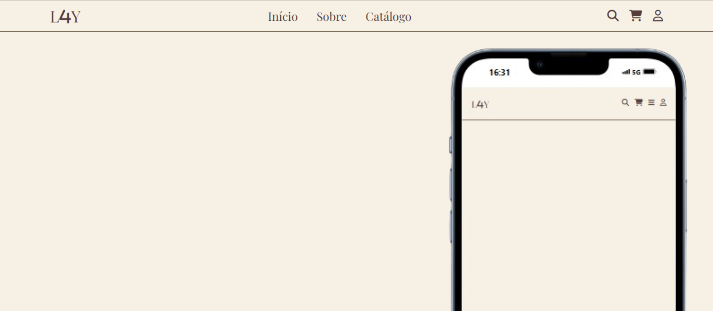

<h1 align="center"> Header Mobile Icons </h1>

Programa para modelagem de um header mobile, onde as informações são acessadas por icones de bibliotecas gratuitas.  

  <a href="#-tecnologias">Tecnologias</a>&nbsp;&nbsp;&nbsp;|&nbsp;&nbsp;&nbsp;
  <a href="#-projeto">Projeto</a>

 

  

## 🚀 Tecnologias

Esse projeto foi desenvolvido com as seguintes tecnologias:

- HTML e CSS
- JavaScript
- Git e Github

## 💻 Projeto

O Header Icons é um modelo de cabeçalho mobile pronto, seus icones podem conter acessos externos e proveem de uma biblioteca online.

---

By Giovanna Camargo.
